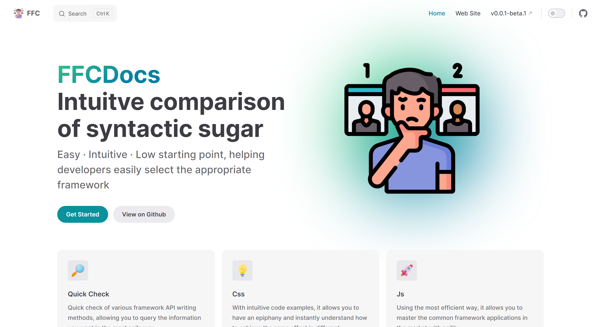

<h1 align="center">
FFCDocs
</h1>

Intuitve comparison of syntactic sugar

  

<a href="https://ffc.fe-ecosphere.com/"><b>Get Started!</b></a>

---

    

---

## 🌸 Thanks
This project is heavily inspired by the following awesome projects.

- https://github.com/matschik/component-party.dev

## ⚖️ License

MIT License © 2023-PRESENT Qingyun119